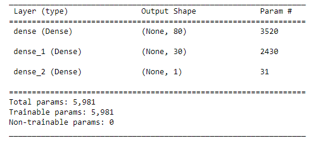
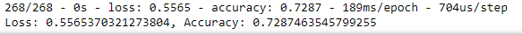

# Neural_Network_Charity_Analysis

## Overview of Project  

**Purpose:**  
The purpose of this project is to create a deep learning neural network model for a non-profit foundation, Alphabet Soup, to predict which organizations are worth donating to and which are too high risk.  

## Resources:  
- Data Source: [charity_data](https://github.com/tonywang3571/Neural_Network_Charity_Analysis/blob/master/Resources/charity_data.csv)  
- Software: Python 3.9.7, Jupyter Notebook 6.4.5, scikit-learn, tensorflow  

## Analysis and Results  

**Analysis:**  
I performed ETL on our dataset to transform the data needed for our specific analysis and for building our model. I then created a density plot to determine how to split the data into different bins or buckets. I then split the data into training and testing groups to evaluate our model to see how accurately it predicts donation candidates from our dataset.  

**Results:**  
- Data Preprocessing  
  - Our target variable for this model is the "IS_SUCCESSFUL" column. This will be the output of the neural network model is trying to predict.  
  - All other variables are considered to the be target variable (Application Type, Affiliation, Classification, Use_Case, Organization, status, Income Amount, Special Consideration, Ask Amount).  
  - The "Name" and "EIN" variables were dropped at the start of our analysis as they did not add any value to the analysis.  

- Compiling, Training, and Evaluating the Model  
  - Initially, we performed the test with 2 hidden layers with 80 and 30 neurons respectively, as well as activation function "relu" to match the sample code. The initial model had a performance of 72.8% accuracy.  

  

  
- Optimization Attempts and Results
  - The target model performance of 75% or greater was not obtained with the 3 optimization attempts. All models were roughly similar to each other at around 72-73%.  
  - Optimization Attempt 1, increase number of hidden layers to 3 with 50 neurons. Accuracy of 72.9%.  
  - Optimization Attempt 2, increase number of hidden layers to 4 with 50 and 80 neurons respectively, cahnged activation to "tanh" for 2nd and 3rd hidden layer, increase Epoch to 100. Accuracy of 72.7%.  
  - Optimization Attempt 3, increase number of hidden layers to 3 with 50 neurons, adjusted bins from 500 to 600 and from 1500 to 6000. Accuracy of 72.7%.  

## Summary  

**Conclusion:**  

### Codes Used  
(Please look at specific files for codes used)  
Code for [initial analysis](https://github.com/tonywang3571/Neural_Network_Charity_Analysis/blob/master/AlphabetSoupCharity.ipynb)  
Code for [first optimization attempt](https://github.com/tonywang3571/Neural_Network_Charity_Analysis/blob/master/AlphabetSoupCharity_Optimization1.ipynb)  
Code for [second optimization attempt](https://github.com/tonywang3571/Neural_Network_Charity_Analysis/blob/master/AlphabetSoupCharity_Optimization2.ipynb)  
Code for [third optimization attempt](https://github.com/tonywang3571/Neural_Network_Charity_Analysis/blob/master/AlphabetSoupCharity_Optimization3.ipynb)  